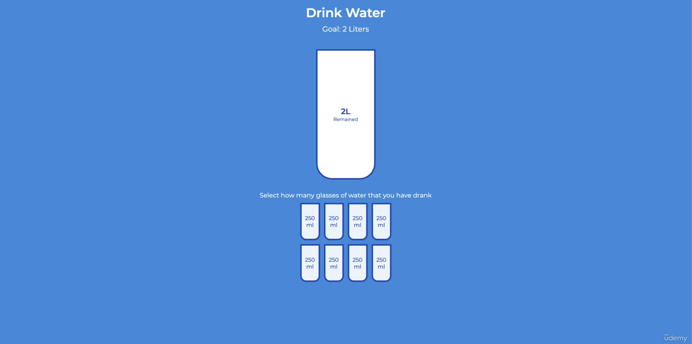

# Hydrate Yourself - Drinking water app 

## Description

This app was made as one of 50 mini projects on Brad Traversy's Udemy course - find the repo below:
https://github.com/bradtraversy/50projects50days

It is a water drinking application where the user can select the amount of glasses they have had to meet the goal of 2 litres. 

Using HTML, CSS and vanilla JavaScript to finalize the application. 

## Added on after the tutorial

The functionality and initial styling was made following the tutorial and the further styling was implemented by me, using CSS. 

### Starter

### Final

